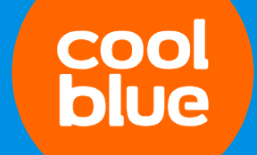
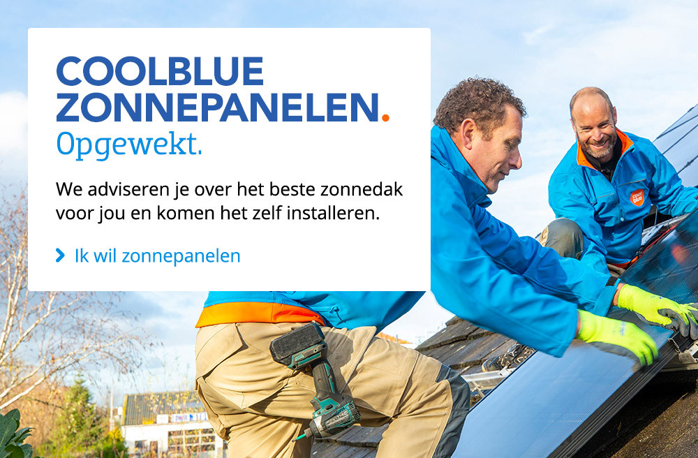
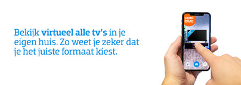
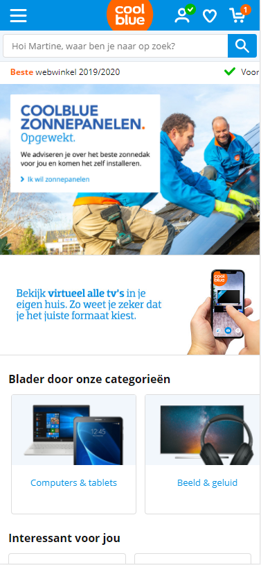
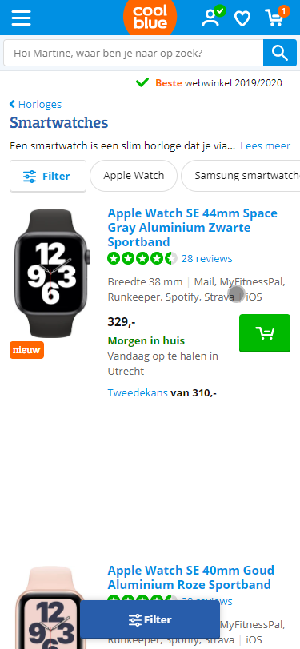
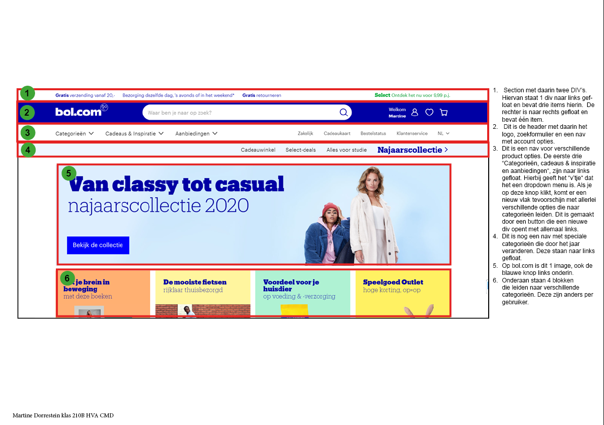
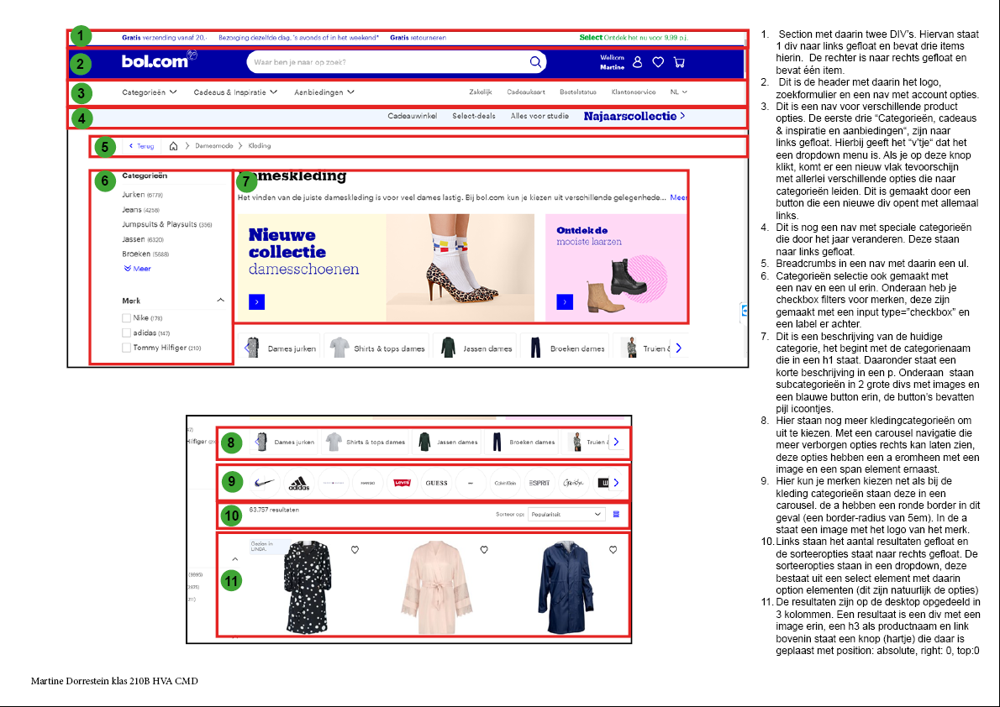

# Procesverslag
Martine Dorrestein 

Markdown cheat cheet: [Hulp bij het schrijven van Markdown](https://github.com/adam-p/markdown-here/wiki/Markdown-Cheatsheet). Nb. de standaardstructuur en de spartaanse opmaak zijn helemaal prima. Het gaat om de inhoud van je procesverslag. Besteedt de tijd voor pracht en praal aan je website.

## Bronnenlijst
1. -bron 1-
2. -bron 2-
3. -...-

## Eindgesprek (week 7/8)

-dit ging goed & dit was lastig-

**Screenshot(s):**

-screenshot(s) van je eindresultaat-

## Voortgang 3 (Met Sanne, ik ga tijdens mijn eerste gesprek Sanne zijn verbeteringen noteren en hier opschrijven.)

-same as voortgang 1-

## Voortgang 2 (Met Janno)

### Stand van zaken

Dit is hoe mijn code er voor het gesprek met Janno uitziet. Janno zag al snel veel fouten in mijn code. Ik had bijvoorbeeld de naam met een hoofdletter gedaan en geen notities toegevoegd. Dit maakte het erg onoverzichtelijk. 

**Screenshot(s):**

<!doctype html>
<html lang="nl">

<head>
	<meta charset="UTF-8">
	<meta name="author" content="jouw naam">
	<meta name="viewport" content="width=device-width, initial-scale=1">

	<title>Naam van je site en/of pagina</title>

	<link rel="stylesheet" href="icons/font-awesome/css/all.css">
	<link
		href="https://fonts.googleapis.com/css2?family=Open+Sans:ital,wght@0,300;0,400;0,600;0,700;0,800;1,300;1,400;1,600;1,700;1,800&display=swap"
		rel="stylesheet">
	<link href="styles/style.css" rel="stylesheet">
</head>

<body>
	<header>
		<section>
			<button><i class="fas fa-bars"></i></button>
			<nav>
				
				<ul>
					<li><a href=""><i class="far fa-user"></i></a></li>
					<li><a href=""><i class="far fa-heart"></i></a></li>
					<li><a href=""><i class="fas fa-shopping-cart"></i></a></li>
				</ul>
			</nav>
		</section>
		<section id="zoeken">
			<input type="search" placeholder="Hoi Martine, waar ben je naar op zoek?">
			<button>
				<i class="fas fa-search"></i></button>
		</section>
	</header>
	<main>
		<section id="ticker">
			
<i class="fas fa-check"> </i>Gratis retourneren

			
<i class="fas fa-check"></i> Beste webwinkel 2019/2020

			
<i class="fas fa-check"></i> Voor zondag 23.59 besteld, maandag gratis bezorgd
			

		</section>
		<section id="hero"></section>
		<section id="reclame1">
			
			
		</section>
		<section id="categorieen">
			<h1>Blader door onze categorieën</h1>
			

				

					<section class="categorie">
						<a href="">
							
							
Computers & tablets

						</a>
					</section>
				

			

		</section>
		<section class="vinkregel">
			

		</section>
		<section id="eerder-bekeken"></section>
		<section class="vinkregel">
			

		</section>
		<section id="reclame2"></section>
		<section class="vinkregel">
			

		</section>
		<section id="aandachtstrekkers"></section>
	</main>
	<footer>
		<nav>
			<ul>
				<li></li>
			</ul>
		</nav>
		<section id="vraag"></section>
		<section id="betaalmogelijkheden">
			

			

		</section>
		<section id="voorwaarden">
			<nav>
				<ul>
					<li></li>
				</ul>
			</nav>
			

			

		</section>
	</footer>
	
</body>

### Agenda voor meeting

- Wat vind je van mijn code?
- Hoe kan ik overzicht creeëren?
- Hoe kan ik inline elementen een andere kleur geven?
- Hoe kan ik alles overzichtelijk noteren?

### Verslag van meeting

Ik heb erg veel aan dit feedback moment gehad. Janno heeft mij het volgende uitgelegd;
- Hoe ik meer overzicht kan creeëren in mijn html pagina.
- Hoe ik bestanden moet opslaan.
- Hoe ik inline elementen een andere kleur kan geven, dit heb ik gedaan door middel van . Dit was voor mij nog onbekend.
- Dat ik mijn gehele html pagina in het engels moet schrijven zodat het ook overzichtelijk is voor andere webontwikkelaars in de toekomst.
- Janno heeft mij laten zien hoe ik via de terminal de website aan Github kan linken. Ik moet eerlijk zeggen dat ik er niet veel van begreep en dat Janno uiteindelijk hierbij de overhand nam. Uiteindelijk heb ik dit aangegeven bij Janno en hebben wij samen een stappenplan gemaakt om via Git bash mijn code naar Github te sturen.
Het stappenplan ziet er als volgt uit;
cd desktop
cd frontend-development
git add .
git commit -m "commit message"
git push

- Janno heeft mij kennis laten maken met  elementen, hij heeft verteld dat dit een inline element is. Dit heb ik uiteindelijk erg veel toegepast op mijn html.

## Voortgang 1 (Met studentenassistenten)

### Stand van zaken

Afgelopen twee weken ben ik ziek geweest waardoor ik niks heb gedaan. Echter heb ik nu wel de keuze gemaakt om in plaats van Bol.com toch voor Coolblue te gaan aangezien deze website minder complex in elkaar steekt. Daarnaast heb ik ook een breakdownschets voor Coolblue gemaakt.

**Screenshot(s):**

Zie de Breakdown schets van Coolblue bij bestanden.

### Agenda voor meeting

- Hoe maak ik een slideshow?
- Hoe voeg ik een afbeelding toe?
- Kan je mijn code nakijken?
- Hoe plak ik een svg bestand in mijn html?
- Moet ik ook de het hamburgermenu overnemen?

### Verslag van meeting

Dit was mijn eerste voortgang gesprek samen met de studentenassistenten. Ik heb veel vragen gesteld waarbij de studenten en andere klasgenoten mij hebben geholpen. Helaas had ik geen tijd om mijn code te laten zien, dit ga ik een andere keer doen. Wat ze zagen vonden ze in iedergeval goed eruit zien, echter loop ik wel nog flink achter.

## Intake (week 1)

**Je startniveau:** blauw

**Je focus:** responsive

**Je opdracht:** https://www.coolblue.nl/

**Screenshot(s):**

**Breakdown-schets(en):**

